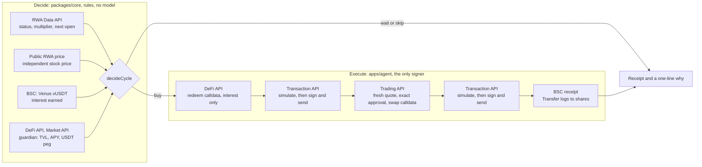

# Yieldvest — Interest becomes ownership.

> **In one line:** an agent that keeps your principal in a USDT savings pool (Venus on BNB Smart Chain) and buys tokenized US stocks (bStocks / Ondo) with the interest — or a fixed amount in safe mode — **only during the US regular session**, under hard caps, with an on-chain receipt and a one-sentence reason for every action.

An entry for BNB Hack: Tokenized Stocks Edition. Build 9/23 → internal submission 10/9 → deadline 10/11 12:00 UTC.

**Live:** filled in after deploy · **Video:** M4-02 · **DX report:** M4-01 · **Judge Mode:** the judge code in the submission form

## 60-second summary

The principal stays in a USDT interest account (Venus), and pieces of tokenized US stocks are bought **only with the interest (or a set contribution)** and **only during the US regular session**. Safe mode (contribution only) is the default. Decisions are made by decision rules (`packages/core` `decideCycle`, 100% coverage), not by a model, and every buy is signed **only after a dry run through the Binance Web3 Transaction API**. Every cycle leaves a receipt (BscScan) and a one-line reason (`why.*`), and the reasons it cannot buy (market closed, price gap, limits, guardian) are shown as they are, too.

## Not on the organizers' ideas list

The official "Ideas to Build" include "Auto-DCA and rebalancing" and "Buy your first stock on-chain" ([JUDGING §1](docs/JUDGING.md)); Judge Mode's default, a fixed $5 contribution, is exactly that. What Yieldvest adds:

- **Interest buys the stock.** The DeFi API and the Trading API in one cycle: a yield plan takes the interest its Venus deposit has earned out of Venus and buys the stock with it (`apps/agent/src/cycle.ts`).
- **Tokenized-stock rules in the engine.** Buys only in the NYSE regular session (holidays, early closes, daylight saving); the RWA Data API's `ASSET_PAUSED` / `ASSET_LIMITED` codes hold a buy around earnings, dividends and splits; amounts are shown in shares, tokens × the bStocks multiplier read on chain. Each hold is a sentence the user sees (`packages/core`).
- **The server decides, the user's AI assistant signs.** The Wallet Skill gets exact `baw` commands from `/next`, runs them in the user's Agentic Wallet after the user says yes, and reports back; the server checks every report on chain and holds no key or session (`skills/yieldvest`).
- **A Uniswap v4 hook priced by the NYSE session**, so LPs of tokenized stocks are paid for the overnight gap risk only these assets carry (`packages/rwa-lp`, tested on a BSC fork, not deployed).
- **Check before money moves.** `/check` runs the agent's own engine on a plan that does not exist yet and shows each rule it read against its limit; `/compare` puts the two tokens of one US share — bStocks and Ondo — side by side, in shares per dollar. Both are MCP tools too, so any assistant can ask ([below](#before-you-buy-and-after-check-compare-project-hold)).

## 3-minute trial (Judge Mode, `/invest` — the old address `/judge` also leads here)

**Try it** or the Invest tab → code → stock (NVDA, etc.) → Contribution only · $5 · regular session → **Dry-run it** (the worker simulates it on-chain) → **Buy now** → a receipt or "Waiting" (if the market is closed, it buys automatically at the next open +2 min) → **Stop this plan**.
1 code = up to $5, and the money comes from Yieldvest's house wallet. The plan ends automatically after 7 days.

## Before you buy, and after: check, compare, project, hold

Read-only, from the worker's latest market recording, each with its data state (live, minutes old, or unavailable with the reason). None of them can create a plan or move funds ([DECISIONS D-31](docs/DECISIONS.md)).

| Where | What it answers |
| --- | --- |
| `/check` · `GET /api/preflight?ticker=NVDA&usd=5` | **Would it buy right now?** `decideCycle` — the code the agent and a skill plan's `/next` run — on a plan you have not made, once per token: buy (about how many shares), wait (until when) or skip, with the agent's own one-line reason, and every rule's input against its limit: data age, guardian, US session, amount vs the venue minimum, token status, price vs the US stock, price impact. A buy needs a guardian check in the last 15 minutes. |
| `/compare` · `GET /api/compare?ticker=NVDA` | **bStocks or Ondo?** The same share from two issuers: shares each $5 / $50 / $500 quote was worth, price per share, price impact or the code it was refused with (Ondo refuses exactly $5), status, minimum order, full addresses. Facts with their time; a plan never switches issuer. |
| Earn · `GET /api/projection?depositUsd=1000&ticker=NVDA` | **What would a deposit earn?** At today's listed Venus APY, compounded daily: per day, week, month and year, the days until the interest reaches the first buy (the minimum buy, or the token's venue minimum — Ondo's $5.01), and about how many shares a month buys at a live price. Labeled a projection at today's rate, never a promise. |
| `/wallet` · `GET /api/wallet?address=0x…` | **What do I hold, in shares?** Any BNB Smart Chain address — your Binance Wallet or Agentic Wallet — read on chain at one block: each bStocks or Ondo token in real shares (a bStocks token's own on-chain multiplier, with a scheduled dividend or split), its value at the last recorded price, USDT, the Venus position and the Yieldvest plans that use it. |
| `POST /api/mcp` | The same answers, plus market status, wallets, plan records and receipts, as a **read-only MCP server** (Streamable HTTP; checked with the official MCP SDK client): `claude mcp add --transport http yieldvest <site URL>/api/mcp` |
| `GET /api/agent` | The agent's **ERC-8004 registration file** in BNB Agent Studio's format (name, what it does, the MCP server and the site; the registry entry once registered) — what `pnpm agent:register` puts on the BSC identity registry ([D-33](docs/DECISIONS.md)) |

## What Yieldvest ran itself

`pnpm receipts:table` builds this table from the DB (time · plan · action · outcome/reason · receipt). **Currently 0 receipts** — topping up the house wallet and switching to live are waiting on the humans' money decisions (REPLAN R1–R4). They get pasted here as they come in. Until the first one, the Overview's receipt panel shows **the agent deciding right now** for its own $5 plan — `/check`'s verdict on the latest market recording, with the recording's state and a link to every rule (PD-06); each receipt, once there, carries the Binance Web3 Wallet API's own status of its transaction under the BSC link (PD-05).

## Verify it yourself

| Command | What it shows | Result on 10/3 |
| --- | --- | --- |
| `pnpm typecheck && pnpm lint && pnpm test` | types, lint, the copy lint, 76 test files (`YIELDVEST_TEST_DATABASE_URL` points at a Postgres) | 804 passed with the docs snapshot (`scripts/fetch-docs.sh`); without it, its 10 checks skip |
| `pnpm --filter @yieldvest/web build && pnpm e2e --database postgres://…/yieldvest_e2e` | Judge Mode end to end in Chromium at 375 and 1280 px, in simulate mode over a test world (no network), then the first screen, `/check`, `/compare`, the Earn calculator, `/wallet`, the MCP block and the agent card it links | green in CI on every push |
| `pnpm lp:test` | the Uniswap v4 hook, the reference oracle and the LP vault | 144 Foundry tests; `BSC_FORK_URL=…` adds 2 on BSC mainnet state |
| `pnpm dx:repro` | each DX finding ([`dx/findings`](dx/findings/README.md)) against the platform as it is now | 4 of 4 keyless findings reproduced; 6 need a key |
| `docker compose up --build` | the app on your machine, simulate mode | see [Run](#run) |

GitHub Actions (`.github/workflows/ci.yml`) runs the first three on every push.

## How it holds up: known traps → code → test

Every row is something the Binance Web3 API, the venues or the chain do that a first integration gets wrong — most found the hard way ([`dx/LOG.md`](dx/LOG.md)). Each is handled in one place and pinned by a named test; `pnpm test` runs them all. Until the live link: `docker compose up --build` ([Run](#run)) or `pnpm e2e` shows the same code on your machine in simulate mode.

| Trap | Handled in | Pinned by |
| --- | --- | --- |
| Errors come back as HTTP 200 with a business code | `packages/binance/src/client.ts` (envelope → `BinanceApiError`) | `client.test.ts` "raises HTTP-200 business errors as BinanceApiError" |
| The signature covers `/build`, the path and the query exactly as sent; two identical requests in one millisecond are a replay (40103) | `packages/binance/src/client.ts` | `client.test.ts` "signs exactly the path and query that go on the wire, with /build", "never signs two identical requests in the same millisecond alike (40103 replay)" |
| The limit is 5 per endpoint in any 1,000 ms window (a token bucket still gets 429s); DeFi endpoints share one 5 QPS | `packages/binance/src/rate-limit.ts` | `rate-limit.test.ts` "replays the 2026-09-24 quote burst without a sixth call inside one second", "makes DeFi endpoints share one 5 QPS budget" |
| One code means different things per module (40470: a Solana fee in Trading, "not found" in DeFi, renumbered to 40490) | `packages/binance/src/taxonomy.ts` | `taxonomy.test.ts` "gives a code the meaning of its own module", and "every … code we map is on that page" against the docs snapshot |
| A `quoteId` lives 30 s | `MAX_QUOTE_AGE_MS` (25 s) in `packages/core/src/decide.ts`, checked again at signing (`apps/agent/src/executor/trade.ts`) | `decide.test.ts` "re-quotes a quote older than 25 s (the id lives 30 s)" |
| Off-hours, the venues refuse quotes (bStocks 40369, Ondo 40367), and bStocks still says TRADING overnight | `OFF_HOURS_QUOTE_CODES` in `decide.ts`; our own NYSE calendar, `packages/core/src/session.ts` | `decide.test.ts` "defers when the venue rejects the quote as off-hours"; `market.test.ts` "keeps a regular-session plan closed overnight although bStocks says TRADING (our NYSE calendar)" |
| NYSE holidays, early closes, daylight saving | `packages/core/src/session.ts` | `session.test.ts` "tags weekends and NYSE holidays", "closes at 13:00 ET on early-close days", "follows the DST switch (EST, UTC−5, from 1 Nov 2026)" |
| Earnings, dividends and splits hold a token (`ASSET_PAUSED` / `ASSET_LIMITED` with a reason) | `CORPORATE_ACTION_CODES` in `decide.ts` | `decide.test.ts` "skips for earnings without switching issuer", "uses the dividend line for cash and stock dividends" |
| Ondo refuses exactly its minimum ($5.00 → 40375) | `venueMinimumUsd` in `taxonomy.ts`; `packages/core/src/venues.ts` | `taxonomy.test.ts` "reads the minimum from the 40375 message"; `decide.test.ts` "says a $5 plan can never buy an Ondo-only stock, instead of promising to" |
| Tokens are not shares: a bStocks token × its `uiMultiplier`, which a split or dividend moves | `packages/chain/src/index.ts` (multiplier, next multiplier and its time at one block); `packages/core/src/holdings.ts` | `packages/chain/src/index.test.ts` "reads every field at one block and feeds the core maths"; `holdings.test.ts` "recomputes shares after a split moves the multiplier (balanceOf unchanged)" |
| The DeFi deposit build approves the maximum | our own exact `approve(vToken, amount)`, `apps/agent/src/executor/venus.ts` | `venus.test.ts` "simulates our exact approval, never the unlimited APPROVE item, and signs nothing" |
| Simulation takes one transaction: an approval does not carry into the next one, and the simulating node can be a block behind ours | each step simulated after the previous one is mined; `simulateAfterApproval` in `trade.ts` | `venus.test.ts` "simulates the deposit again while the API’s node has not seen the approval yet" |
| A DeFi redeem is sized at the vToken rate the API reads, and that rate jumps whenever someone touches the market | `redeemLimit` in `venus.ts` | `venus.test.ts` "accepts the build when interest accrued between the API’s read and ours, either way" |
| A compliance refusal (KYT, region) is final; a server error can come after a relay | `apps/agent/src/executor/send.ts` | `send.test.ts` "calls "underpriced" final only when the Transaction API itself answered", "leaves a row to the process holding its plan’s lock: never sent around its broadcast" |
| A broadcast transaction is not indexed at once | `packages/binance/src/wallet.ts` | `wallet.test.ts` "reads an empty list as not indexed yet (the docs: indexing may lag the broadcast)" |
| A process dies between signing and recording | the signed bytes are written down before they leave; every tick settles them against the chain (`send.ts`, `apps/agent/src/settlement.ts`) | `send.test.ts` "tracks bytes that may have gone out, and sends them again once the node is back"; `settlement.test.ts` "books an interest redeem once when the cycle dies after it confirmed" |

## One cycle across the modules



In safe mode the cycle skips the redeem. In the Wallet Skill the same decision comes from `/next` and the user's own Agentic Wallet signs each step.

## Module matrix (PLAN §6.1 + status as of the code)

| Module | Where Yieldvest uses it | Status | Code → test |
| --- | --- | --- | --- |
| RWA Data API | Token list (address, multiplier, status code, next open), RWA prices — registry, tape, decisions | In use (Frankfurt worker, tape every 10 min) | `apps/agent/src/registry.ts`, `market.ts` → `registry.test.ts`, `market.test.ts` |
| Public bapi RWA Dynamic V2 (outside the Web3 API) | US stock price (`stockInfo.price`, null off-hours) — gap calculation, tape. A public endpoint with no key; the only docs are Skills Hub `binance-tokenized-securities-info` | In use (`apps/agent/src/stock-price.ts`) | `apps/agent/src/stock-price.ts` → `stock-price.test.ts` |
| Market API | USDT price (depeg guardian) | Code done | `apps/agent/src/guardian.ts`, `packages/core/src/guardian.ts` → `guardian.test.ts`, `scheduler.test.ts` |
| Trading API | Quotes (price impact, route), exact-amount approval calldata, swap calldata | Quotes in use (tape); signing path waiting for live | `apps/agent/src/executor/trade.ts` → `cycle.test.ts`, `decide.test.ts` |
| Transaction API | Simulation before every signature, gas limit estimation, broadcast (an alternative path to RPC) | Code done, waiting for live. Receipts are confirmed over BSC RPC; the status lookup is the Wallet API's (next row) | `apps/agent/src/executor/send.ts` → `send.test.ts` |
| DeFi API | Venus USDT investment and APY (`apyDisplay`), TVL and security score (guardian, risk disclosure), deposit and redeem calldata | Code done | `apps/agent/src/executor/venus.ts` → `venus.test.ts`, `settlement.test.ts` |
| Wallet API | The official flow's last step: each receipt's transaction looked up by hash (`transaction-detail-by-txhash`) once its BSC receipt settled it — status and fee shown under the receipt link, a disagreement shown as one — and the house balances (`token-balances-by-address`) compared with the RPC read on every tick, in `/api/judge/smoke`. Read-only, never in the signing path; the chain stays the record (DECISIONS D-34) | Code done (worker, `apps/agent/src/wallet-index.ts`); first live answers with the API key | `packages/binance/src/wallet.ts`, `apps/agent/src/wallet-index.ts` → `wallet.test.ts`, `wallet-index.test.ts` |
| Agentic Wallet / Wallet Skills | `skills/yieldvest`: the server hands out only `baw` commands via `/next` (and `/position` to take a stopped plan's own deposit out), signing happens on the user's device, `/report` is checked on chain. Every `baw` command and flag is tested against the real CLI's recorded help (`pnpm baw:help`, `baw` 1.10.0), and the quote check is in the shares `baw` prints | Code and docs done; the real-run demo is done by a human (M2-09) | `skills/yieldvest`, `apps/web/lib/server/next.ts` → `baw-contract.test.ts`, `skill.test.ts` |
| b402 Payments | — | Not built (M3-01, cut candidate) | — |
| BNB Agent Studio | ERC-8004 identity: `GET /api/agent` serves the registration file — byte for byte what `@bnbagent/sdk` 0.6.0 builds (tested against it) — pointing at the read-only MCP server; `pnpm agent:register` puts it on the BSC identity registry from a wallet of its own: dry run, Transaction API simulation, fee bound, typed `y` (DECISIONS D-33) | Code done, dry run on real BSC (agent URI 857 bytes, 767,983 gas); the registration itself after the web deploy (M2-10, RUNBOOK §6.2) | `apps/web/lib/agent-card.ts`, `packages/chain/src/erc8004.ts`, `scripts/agent-register.ts` → `agent-card.test.ts`, `erc8004.test.ts`, `agent-register-rules.test.ts` |
| BSC | viem reads and writes, amounts confirmed from the receipt's Transfer logs, Venus vToken | In use | `packages/chain/src/index.ts`, `apps/agent/src/executor/chain-port.ts` → `index.test.ts`, `chain-port.test.ts` |

## Use it with my AI assistant (Agentic Wallet, mode C)

```bash
npx skills add mycyi1994-hash/NewBNBHACK --skill yieldvest -g -a claude-code -y
export YIELDVEST_URL=<site URL>
```

One line, with the same installer the Binance Skills Hub uses (`skills` CLI, checked with 1.7.0 on 10/3: `skills/yieldvest` lands in `~/.claude/skills/yieldvest` file for file). Without Node: `git clone --depth 1 https://github.com/mycyi1994-hash/NewBNBHACK yieldvest-src && mkdir -p ~/.claude/skills && cp -r yieldvest-src/skills/yieldvest ~/.claude/skills/`.

Then say "Start Yieldvest". Requires: `baw` 1.10.0 (`npm i -g @binance/agentic-wallet@1.10.0`), the `binance-agentic-wallet` and `query-token-audit` skills (`npx skills add binance/binance-skills-hub/skills/binance-web3/<skill>`), USDT to buy and a little BNB for gas. Before each signature the skill checks the command against the plan the user agreed (token, chain, amount within the plan's per-buy limit), that the wallet is not locked by a pending transaction, and the token against the official list; the user confirms with the wallet's own quote in front of them. The server only decides (it stores no keys or sessions); every transaction is signed by the user's wallet after the user confirms. API contract: `/api/openapi` (OpenAPI 3.1). Before a plan exists, the skill can show the user `/api/compare` (to choose a token) and `/api/preflight` (what the rules would do now); an assistant without the skill can ask the same through the read-only MCP server at `/api/mcp`.

## RWA liquidity (Uniswap v4 hook)

[`packages/rwa-lp`](packages/rwa-lp) lets tokenized stocks be supplied as liquidity without selling the overnight gap for free: a Uniswap v4 hook on BSC's deployed PoolManager charges each swap for the US session it happens in (0.05% regular, 0.30% pre/after-hours, 1.00% closed, a 30-minute ramp after the open), makes the swap that closes a gap to a fresh reference price pay half of that gap, and prices a scheduled bStocks multiplier change (dividend, split) as closed. The session comes from the same NYSE calendar the agent uses, checked on chain against 12,944 vectors. An ERC-20 vault holds the full-range position; withdrawals can never be blocked. Built, fork-tested on real NVDAB and NVDAon, not deployed: deploying and seeding are a human decision. Details: [`docs/RWA_LP.md`](docs/RWA_LP.md).

```bash
pnpm lp:test      # forge: 144 tests (BSC fork suite: BSC_FORK_URL=… pnpm lp:test)
pnpm lp:market    # the tokenized-stock pools already on Uniswap v4 on BSC, live, vs Binance's price
pnpm lp:status    # live state of deployed pools; UNAVAILABLE until one is deployed
```

## Structure

**Frontend design:** The approved BNB-style UI and the Yieldvest logo (source: [frontend-preview](frontend-preview/README.md), handoff: [FRONTEND_HANDOFF.md](FRONTEND_HANDOFF.md)) have been moved into the real web app, `apps/web` (DECISIONS D-25). All 4 tabs — Overview, Earn, Invest (= the judge trial) and Activity — show only real values from the server and the chain. `frontend-preview/` remains as the original design, running on example data.

```
apps/web        Next.js: screens (Overview, Earn, Invest (trial), Activity, Plan, Assistant, Data, Risk) and API. Does not sign and does not call the Web3 API
apps/agent      Worker (the only signer): tape every 10 min, tick every 5 min (outbox, awaiting cycles, guardian, jobs, plans that are due), web jobs every 3 s
packages/core   Decision rules (decideCycle), guardian rules, amount and share-count math, NYSE calendar — pure functions, 100% coverage
packages/binance  Web3 API client: HMAC signing, rate limit, error taxonomy (SPEC §11), call instrumentation (api_calls)
packages/chain  viem: ERC-20, Venus, receipt logs
packages/db     Drizzle schema, migrations (with rollback), spend ledger (advisory lock), outbox, jobs
packages/rwa-lp Uniswap v4 hook, NYSE calendar, reference oracle and LP vault (Foundry) + a read-only TypeScript reader
skills/yieldvest    Wallet Skill (SKILL.md + references)
```

## Safety measures (summary — details in [`docs/SECURITY.md`](docs/SECURITY.md))

- Hard caps are read from one place in env and enforced by code: $25 per tx and $50 per day (house), $5 per judge code. Spending is reserved in the ledger under a lock.
- Exact-amount approvals only; calldata is decoded and verified before signing (a swap may only call the approved router); **no signature without a simulation SUCCESS**; if there is no receipt within 3 minutes, the outbox stays PENDING and new signing is blocked. Effects confirmed on chain are recorded exactly once, in one transaction together with the receipt — when the outcome is unclear, it does not guess but asks a human ([DECISIONS D-23](docs/DECISIONS.md)).
- Guardian: Venus paused, TVL −30% in 24 hours, utilization 95%, USDT at 0.99 for 30 minutes → stop buying / redeem everything (in live, only when the simulation passes).
- Every data block is one of Live / n min old / Unavailable (reason). It does not make up numbers.
- CSP (a nonce per request), HSTS, no horizontal scroll on a 375px screen, English only (D-26) (`pnpm ui:check`).

## Risk

[`/risk`](apps/web/app/risk/page.tsx) — Yieldvest is not a bank. You can lose principal (a Venus hack, a USDT depeg). Interest rates change daily and stock prices go up and down. Safe mode (contribution only) is the default.

## Run

**With Docker, nothing else to install** (simulate mode: nothing is signed, no wallet key is used):

```bash
docker compose up --build    # http://localhost:3000 · judge code LOCAL-JUDGE
docker compose down -v       # stop and delete the local database
```

Postgres, migrations and seed, the web app and the worker start together (`compose.yaml`, `Dockerfile.local`). Without a Binance Web3 API key every screen says what it cannot show and why, and `/api/judge/smoke` shows the RPC and the database green and the rest red with its reason (checked 10/1). With `BINANCE_WEB3_API_KEY` and `BINANCE_WEB3_API_SECRET` in your environment the worker records live quotes and market status every 10 minutes. Judge Mode's dry runs also need a house wallet, which this setup leaves out on purpose; the whole Judge Mode flow runs in `pnpm e2e` (below) and on the live site.

**With pnpm:**

```bash
pnpm i
cp .env.example .env          # EXECUTION_MODE=simulate (the default) signs nothing. The web starts without keys;
                              # the worker's tape and decisions need a Binance Web3 API key (Q-01: use it from one region only)
pnpm db:migrate && pnpm db:seed   # needs DATABASE_URL (Postgres)
pnpm dev                      # web + worker. With no data, the screens honestly show "Unavailable (reason)"
pnpm typecheck && pnpm lint && pnpm test   # test DB: YIELDVEST_TEST_DATABASE_URL
pnpm --filter @yieldvest/web build && pnpm e2e --database postgres://…/yieldvest_e2e
                              # Judge Mode in Chromium, simulate mode, no network; the DB name must contain e2e
pnpm smoke --url http://localhost:3000     # /api/judge/smoke
```

Operating procedures: [`docs/RUNBOOK.md`](docs/RUNBOOK.md).

## Document map

| Document | Purpose |
| --- | --- |
| [`docs/JUDGING.md`](docs/JUDGING.md) | Official judging criteria (verbatim) and how features map to them |
| [`docs/PLAN.md`](docs/PLAN.md) | Plan: goals, users, scope, flows, schedule, cut lines |
| [`docs/SPEC.md`](docs/SPEC.md) | Technical spec: modules, data model, agent loop, guardian, error taxonomy |
| [`docs/TASKS.md`](docs/TASKS.md) | Tickets and evidence |
| [`docs/DECISIONS.md`](docs/DECISIONS.md) | Locked decisions, open questions |
| [`docs/DX_PROTOCOL.md`](docs/DX_PROTOCOL.md) · [`dx/LOG.md`](dx/LOG.md) | Developer-experience evidence |
| [`docs/UX_COPY.md`](docs/UX_COPY.md) | UI copy (English only, D-26 and D-27) |
| [`docs/SECURITY.md`](docs/SECURITY.md) · [`docs/RUNBOOK.md`](docs/RUNBOOK.md) | Security review, operations |
| [`docs/RWA_LP.md`](docs/RWA_LP.md) | RWA liquidity: the Uniswap v4 hook, vault, evidence and deploy runbook |
| [`CLAUDE.md`](CLAUDE.md) · [`docs/GOALS.md`](docs/GOALS.md) | Operating rules and goals for the coding agent |

## License

To be decided before submission (MIT recommended).
