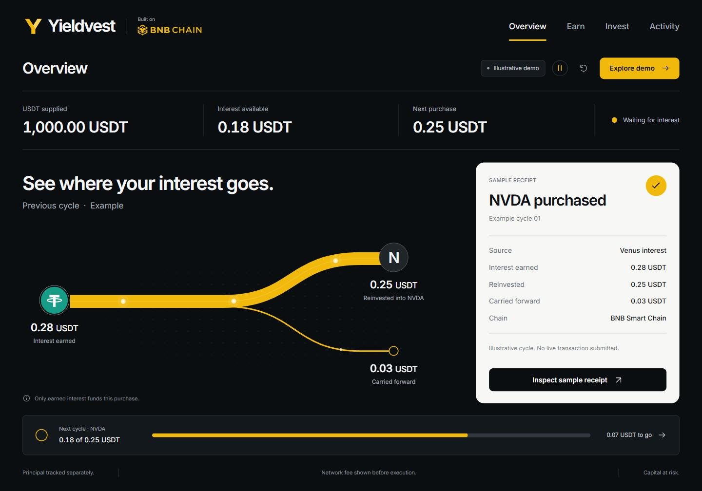

# Yieldvest frontend preview

선택한 3번 디자인을 구현한 독립 실행형 프론트엔드입니다. 기존 apps/web의 서버 코드, 거래 엔진, 데이터베이스, 지갑 로직은 변경하지 않습니다.

개발자 인수인계: [FRONTEND_HANDOFF.md](../FRONTEND_HANDOFF.md). 최초 공유 브랜치: codex/ijaro-frontend. 브랜치 이름은 예전 제품명을 유지하지만 화면과 로고는 Yieldvest입니다.

## 실행

Node.js 22.12 이상을 사용합니다. 이 폴더에서 실행하세요.

~~~powershell
npm ci
npm run dev
~~~

개발 접속: http://127.0.0.1:5173

현재 실행해 둔 배포용 미리보기: http://127.0.0.1:4173
PC 재시작 등으로 미리보기가 종료되면 이 폴더에서 npm run build 후 npm run preview를 실행합니다.

이 폴더는 기존 pnpm workspace와 분리한 프론트 미리보기입니다. 의존성과 lockfile도 이 폴더 안에서 관리합니다.

## 화면과 동작

- Overview: 이자 → 매수 → 이월 흐름과 영수증
- Earn: 현재 사이클의 이자 누적 그래프와 매수 조건
- Invest: NVDA / TSLA / MSFT / QQQ 선택, Interest only / Contribution 전환
- Activity: 이벤트 필터, 선택한 이벤트의 상세 패널
- Receipt details: 금액 분해와 예시 실행 단계
- Explore demo: 샘플 이자 추가 → 종목 선택 → 예시 시뮬레이션 → 확인 → 영수증
- 모바일: 반응형 레이아웃과 하단 네 탭
- 키보드 탐색, 모달 Escape 닫기 및 포커스 복원, 감소된 모션 설정 대응
- 이자 흐름의 빛 입자, 차트 그리기, 탭 표시 이동, 값 변경과 진행률 전환, 모달 등장/퇴장 효과
- 상단 재생/일시정지 버튼. 시스템의 움직임 줄이기 설정을 따르며, 반복 효과는 화면 밖과 비활성 탭에서 중단합니다.

해시 주소를 사용해 탭과 영수증을 연결하며 브라우저 뒤로 가기와 앞으로 가기를 지원합니다. 샘플 계정은 메모리에서만 관리됩니다. 새로고침하거나 Reset demo를 누르면 초기 상태가 됩니다.

## 데이터 범위

모든 숫자, 매수, 시뮬레이션, 영수증은 프론트엔드 예시입니다. API 요청, 지갑 연결, 실제 송금, 주문 제출은 없습니다.

초기 예시:

- 공급 원금 기준액: 1,000.00 USDT
- 이전 이자: 0.28 USDT = 재투자 0.25 + 이월 0.03
- 현재 이자: 0.18 USDT = 이월 0.03 + 신규 이자 0.15
- 예시 최소 매수: 0.25 USDT, 남은 금액 0.07, 진행률 72%

금액 계산은 정수 센트로 처리합니다. 재확인으로 중복 예시 매수가 생기지 않도록 방지하며, 종목 변경은 기존 영수증을 수정하지 않습니다. Contribution은 이자 잔액을 사용하지 않습니다.

실제 연동 시 종목 지원 여부, 공급자별 최소 금액, 시장 시간, 수수료, 실제 수령 수량과 거래 해시를 검증된 데이터로 교체해야 합니다. 예시 최소 금액을 전체 공급자에 공통 적용하면 안 됩니다.

## 검사와 배포용 빌드

~~~powershell
npm test
npm run build
npm run preview
~~~

빌드 결과는 dist에 생성됩니다. 정적 호스팅에 올릴 수 있으며, 별도 서버나 데이터베이스가 필요하지 않습니다. 현재 작업에서는 공개 호스팅에 배포하지 않았습니다.

## 구성

- src/App.tsx: 화면, 탐색, 체험 흐름
- src/components.tsx: 영수증, 흐름도, 차트, 진행 표시, 모달
- src/model.ts: 예시 상태와 금액 계산
- src/styles.css, src/tokens.css: 반응형 디자인
- src/motion.tsx, src/motion.css: 모션 설정, 전환 및 흐름 효과 (추가 라이브러리 없음)
- public/bnb-chain.svg: 공식 BNB Chain 로고
- public/yieldvest-mark.svg: Y와 V의 열린 형태를 결합한 Yieldvest 심벌. 워드마크는 로컬 Inter Variable로 표시합니다.

디자인 기준: #0B0E11 캔버스, #F0B90B 강조, #F7F7F5 영수증, 로컬 Inter Variable 폰트. 강조는 이자 흐름과 주요 행동에 집중합니다.
